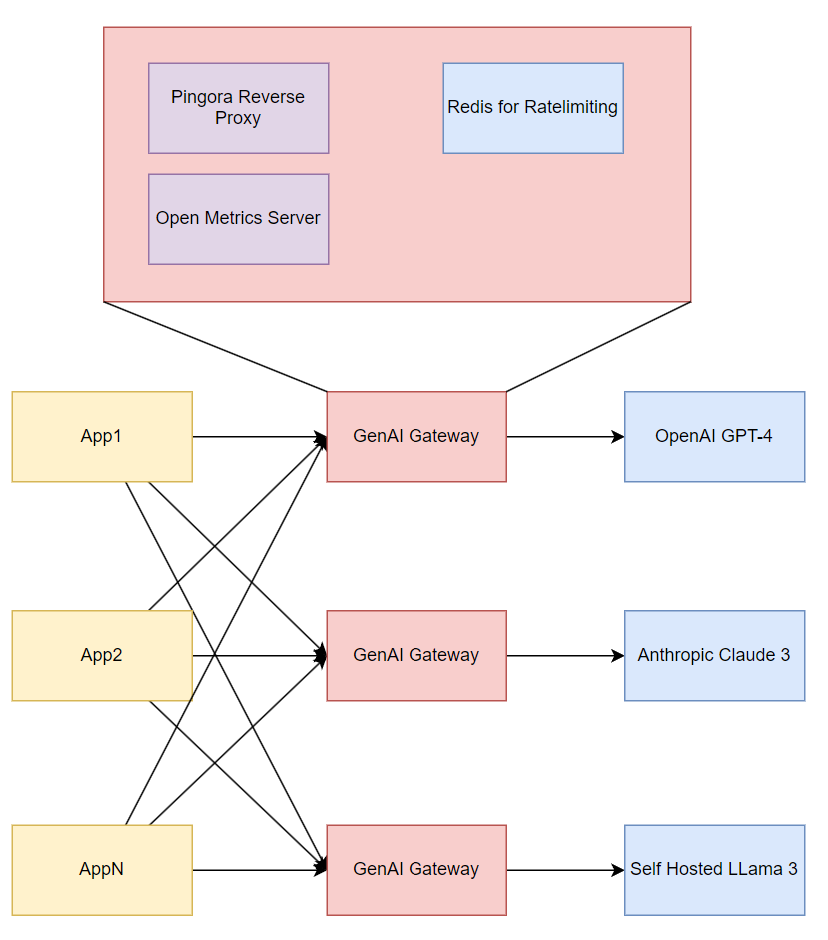

# GenAI Gateway

Many developers are integrating large language models (LLMs) into their applications to process user input and generate
responses. This integration presents challenges such as:

- Implementing rate limiting to prevent a single user from exceeding a predefined number of tokens and generating a lot
  of costs.
- Collecting metrics on token usage per model or request or user.
- Providing a standardized entry point for various providers (OpenAI, Anthropic, Self-Hosted LLMs).

This project addresses these challenges by offering a gateway that facilitates interaction with different LLMs.



# Config

The gateway can be configured via flags or environment variables. The following flags are available:

```bash
Usage: genai-gateway [OPTIONS]

Options:
      --openai-tls
          Enable TLS for downstream OpenAI compatible endpoints
      --openai-port <OPENAI_PORT>
          Port to use for downstream OpenAI compatible endpoints [default: 443]
      --openai-domain <OPENAI_DOMAIN>
          Domain to use for downstream OpenAI compatible endpoints [default: 0.0.0.0]
      --http-proxy-port <HTTP_PROXY_PORT>
          Port to use for HTTP proxy [default: 8080]
      --http-proxy-metrics-port <HTTP_PROXY_METRICS_PORT>
          Port to use for HTTP proxy metrics [default: 9090]
      --enable-rate-limiting
          Enable rate limiting on user key
      --rate-limiting-redis-connection-string <RATE_LIMITING_REDIS_CONNECTION_STRING>
          Redis connection string for the rate limiter [default: redis://127.0.0.1:6379/0]
      --rate-limiting-redis-pool-size <RATE_LIMITING_REDIS_POOL_SIZE>
          Redis pool size for the rate limiter [default: 5]
      --rate-limiting-window-duration-size-min <RATE_LIMITING_WINDOW_DURATION_SIZE_MIN>
          Rate limiting window duration size in minutes [default: 60]
      --rate-limiting-max-prompt-tokens <RATE_LIMITING_MAX_PROMPT_TOKENS>
          Rate limiting max prompt tokens [default: 1000]
      --rate-limiting-user-header-key <RATE_LIMITING_USER_HEADER_KEY>
          Rate limiting user header key [default: user]
  -h, --help
          Print help
  -V, --version
          Print version
```

# Metrics

| Metric Name                                | Labels          | Explanation                                  |
|--------------------------------------------|-----------------|----------------------------------------------|
| `prompt_tokens_total`                      | None            | Number of prompt tokens                      |
| `completion_tokens_total`                  | None            | Number of completion tokens                  |
| `tokens_total`                             | None            | Number of total tokens                       |
| `prompt_tokens_by_model_total`             | `model`         | Number of prompt tokens by model             |
| `completion_tokens_by_model_total`         | `model`         | Number of completion tokens by model         |
| `tokens_by_model_total`                    | `model`         | Number of total tokens by model              |
| `prompt_tokens_by_user_by_model_total`     | `user`, `model` | Number of prompt tokens by user by model     |
| `completion_tokens_by_user_by_model_total` | `user`, `model` | Number of completion tokens by user by model |
| `tokens_by_user_by_model_total`            | `user`, `model` | Number of total tokens by user by model      |

# Usage

Here is an example to use it with the langchain client:

```python
client = OpenAI(
        openai_api_base=http://localhost:8080, # GenAI Gateway URL
        openai_api_key=config["api_key"], # OpenAI API Key. The Gateway will forward this key to the downstream OpenAI endpoint
        model_name="gpt-4o", # Model name
        logit_bias=None,
        default_headers={"user": "user1"}, # User header key which the rate limiter will use to enforce rate limiting per total tokens
    )
```

Keep in mind that you need to set the user header per request to enforce rate limiting per user.

# Development

To build the project, run the following command:

```bash
cargo build
```

Or build a docker image:

```bash
make docker-build-linux
```

To run tests, run the following command:

```bash
make test
```

To format the code, run the following command:

```bash
make fmt
```

To lint the code, run the following command:

```bash
make lint
```
